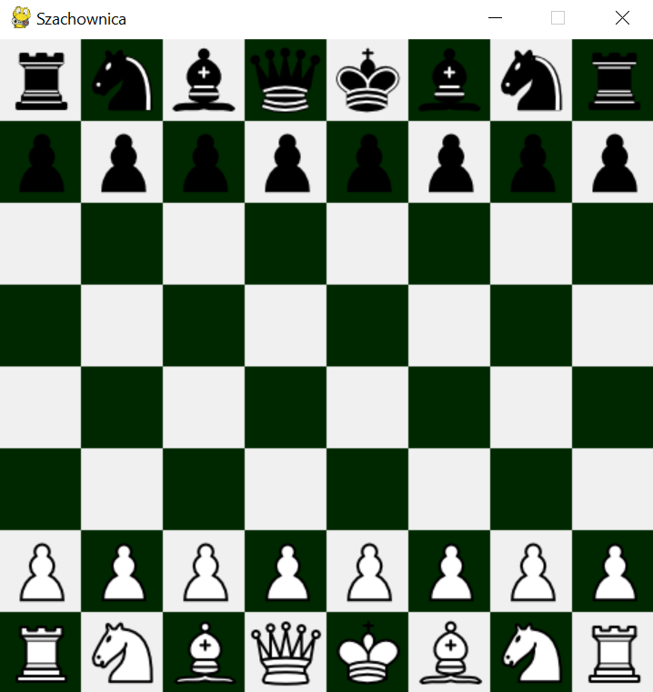
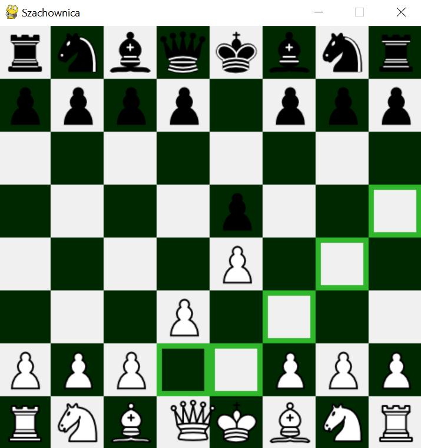
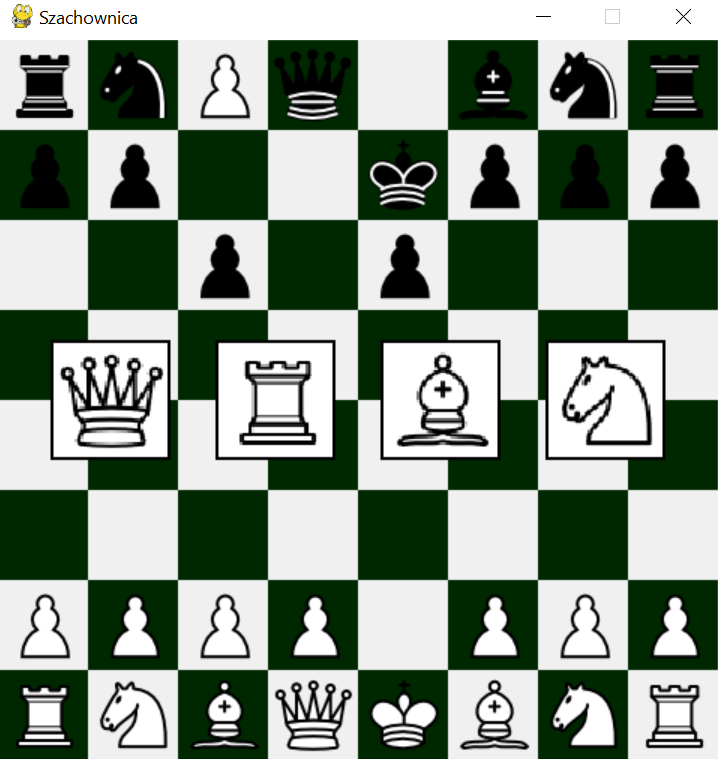
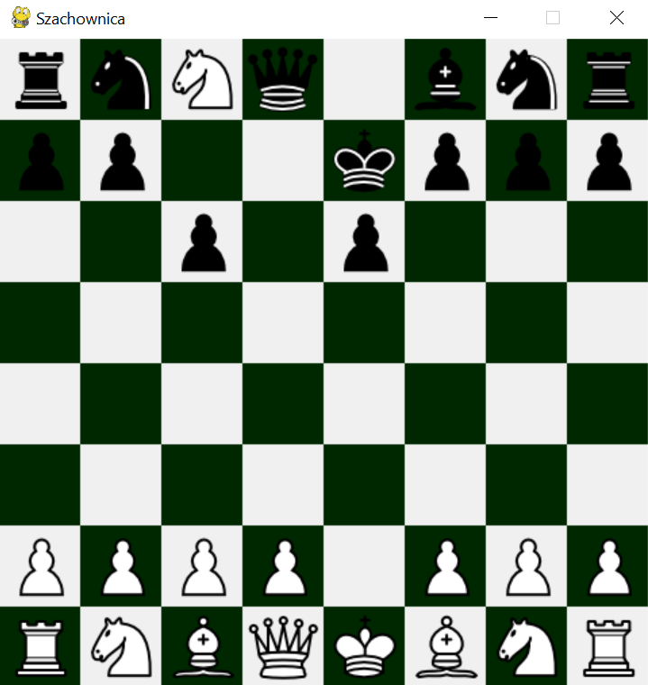

#  Chess AI with Minimax

This is a simple Chess AI built using the **Minimax algorithm** with a graphical interface developed using **Pygame**. The game logic and chess rules are powered by the **python-chess** library. The project allows a human player to play against an AI opponent that makes decisions based on a depth-limited minimax strategy.

## Features

- Minimax-based AI for decision making
- Player vs AI gameplay
- Player can play with white pieces
- Click to select a piece and view legal moves
- Pawn promotion with GUI selection
- Visual board and piece movement using Pygame

---

## Requirements

- Python 3.7 or higher
- [`pygame`](https://www.pygame.org/)
- [`python-chess`](https://python-chess.readthedocs.io/)

Install dependencies with pip:

```bash
pip install pygame python-chess
```

## First version (v1.0)

### Main Game Window  
The chessboard is displayed with all pieces visible:  


---

### Piece Selected  
When you click and hold on a piece, all possible legal moves are highlighted:  


---

### Pawn Promotion  
When a pawn reaches the promotion square, a window appears to choose a new piece:  


### Promoted Pawn
In this case, the pawn was promoted to a knight:
